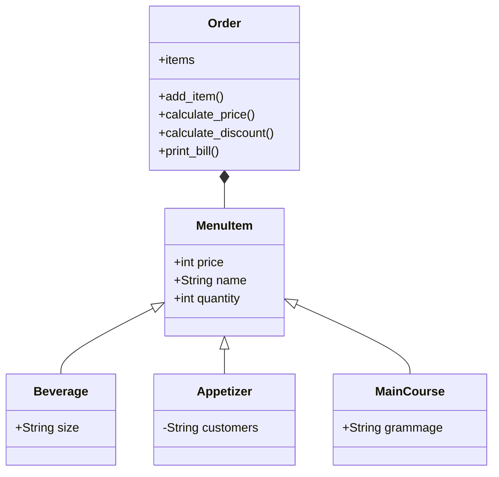

# Reto_03-POO
Reto 03 (clase línea, rectángulo redefinida y restaurante)-Programación Orientada a Objetos 

## 1. Ejercicio de Clase (clase Línea)
```python
class Point:
    def __init__(self, x, y):
        self.x = x
        self.y = y

class Line:
    def __init__(self, point1:Point, point2:Point):
        self.length = None
        self.slope = None
        self.start = point1
        self.end = point2
    
    def compute_length(self):
        if self.length is None:
            self.length = ((self.end.x - self.start.x)**2 + (self.end.y - self.start.y)**2)**0.5
        return self.length
    
    def compute_slope(self):
        if self.slope is None:
            dy = self.end.y - self.start.y
            dx = self.end.x - self.start.x
            self.slope = (dy/dx)
            if dx == 0:
                self.slope = "infinite"                            
        return self.slope
    
    def compute_horizontal_cross(self):
        if self.start.y * self.end.y < 0:
            print("La línea cruza al eje x")
        else:
            print("La línea no cruza al eje x")
    
    def compute_vertical_cross(self):
        if self.start.x * self.end.x < 0:
            print("La línea cruza al eje y")
        else:
            print("La línea no cruza al eje y")

p1 = Point(-2, 5)
p2 = Point(3, 8)
line = Line(p1, p2)

print("La longitud de la línea es: ", line.compute_length())
print("La pendiente de la línea es: ", line.compute_slope())

line.compute_horizontal_cross()
line.compute_vertical_cross()

```
### -Explicación:
Para este ejercicio se definió una clase Point y luego la clase Line, con el objetivo de utilizar dos puntos para definir a la línea. Para la longitud de esta, se calculó la distancia entre los puntos dados. Por su parte, para la pendiente se aplicó la fórmula de la pendiente de una recta a partir de los diferenciales de las coordenadas x y y. En caso de que se obtenga una división por cero, se indica que la línea posee una pendiente infinita. Para poder estimar si la línea intersecta a los ejes, se usó el siguiente razonamiento. Para lograr determinar si una línea cruza a algún eje, por ejemplo el x, las coordenadas en y deben tener signos opuestos (para una intersección con el eje y, las coordenadas en x deben cumplir con la misma condición). Para esto, se multiplicaron los valores para "y" del punto incial y punto final. En caso de obtener un producto positivo, se concluye que los valores poseen el mismo signo y por ende se encuentran sobre un mismo cuadrante. En caso de obtener un producto negativo, se concluye que los valores poseen signos contrarios y por ende están (para el ejemplo del eje x) uno encima del eje y otro por debajo, indicando que si se traza una línea entre los puntos, esta intersecta a al eje. 

## 2. Ejercicio de Clase (clase Rectángulo redefinida)
``` python
class Point:
    def __init__(self, x, y):
        self.x = x
        self.y = y
        
class Line:
    def __init__(self, point1:Point, point2:Point):
        self.length = None
        self.slope = None
        self.start = point1
        self.end = point2
    
    def compute_length(self):
        if self.length is None:
            self.length = ((self.end.x - self.start.x)**2 + (self.end.y - self.start.y)**2)**0.5
        return self.length
    
    def compute_slope(self):
        if self.slope is None:
            dy = self.end.y - self.start.y
            dx = self.end.x - self.start.x
            self.slope = (dy/dx)
            if dx == 0:
                self.slope = "infinite"                            
        return self.slope
    
    def compute_horizontal_cross(self):
        if self.start.y * self.end.y < 0:
            print("La línea cruza al eje x")
        else:
            print("La línea no cruza al eje x")
    
    def compute_vertical_cross(self):
        if self.start.x * self.end.x < 0:
            print("La línea cruza al eje y")
        else:
            print("La línea no cruza al eje y")

class Rectangle:
    def __init__(self, method, *args):
       
        if method == 1:
            self.method_1(*args)
        elif method == 2:
            self.method2(*args)
        elif method == 3:
            self.method3(*args)
        elif method == 4:
            self.method4(*args)

    def method_1(self, bottom_left, width, height):
        self.bottom_left = bottom_left
        self.width = width
        self.height = height
        self.center = Point(bottom_left.x + width / 2, bottom_left.y + height / 2)

    def method2(self, center, width, height):
        self.center = center
        self.width = width
        self.height = height
        self.bottom_left = Point(center.x - width / 2, center.y - height / 2)

    def method3(self, bottom_left, upper_right):
        self.bottom_left = bottom_left
        self.upper_right = upper_right
        self.width = upper_right.x - bottom_left.x
        self.height = upper_right.y - bottom_left.y
        self.center = Point(bottom_left.x + self.width / 2, bottom_left.y + self.height / 2)
        
    def method4 (self, line1, line2, line3, line4):
        self.line1 = line1
        self.line2 = line2
        self.line3 = line3
        self.line4 = line4
        self.width = line1.compute_length()
        self.height = line2.compute_length()
        self.center = Point(self.line1.start.x + self.width / 2, self.line1.start.y + self.height / 2)

    def compute_area(self):
        return self.width * self.height

    def compute_perimeter(self):
        return 2 * (self.width + self.height)

# 1st Method
method = 1 
bottom_left = Point(0, 0)  
width = 5
height = 3
rectangle1 = Rectangle(method, bottom_left, width, height)  

print("MÉTODO 1")
print("El área del rectángulo es: ", rectangle1.compute_area())
print("El perímetro del rectángulo es: ", rectangle1.compute_perimeter(), "\n")

# 2nd Method
method = 2
center = Point(2, 2)
width = 5
height = 3
rectangle2 = Rectangle(method, center, width, height)
print("MÉTODO 2")
print("El área del rectángulo es: ", rectangle2.compute_area())
print("El perímetro del rectángulo es: ", rectangle2.compute_perimeter(), "\n")

#3rd Method

print("MÉTODO 3")
method = 3
bottom_left = Point(0, 0)
upper_right = Point(5, 3)
rectangle3 = Rectangle(method, bottom_left, upper_right)

print("El área del rectángulo es: ", rectangle3.compute_area())
print("El perímetro del rectángulo es: ", rectangle3.compute_perimeter())

#4th Method

print("MÉTODO 4")
p1 = Point(0, 0)
p2 = Point(5, 0)
p3 = Point(5, 3)
p4 = Point(0, 3)
line1 = Line(p1, p2)
line2 = Line(p2, p3)
line3 = Line(p3, p4)
line4 = Line(p4, p1)
rectangle4 = Rectangle(4, line1, line2, line3, line4)

print("El área del rectángulo es: ", rectangle4.compute_area())
print("El perímetro del rectángulo es: ", rectangle4.compute_perimeter())


```

### -Explicación:
En esta segunda parte se usó la clase anteriormente creada, para añadir un nuuevo método a una clase Rectángulo y así crearuno de estos objetos. Para esto simplemente se usaron 4 líneas creadas a partir de 4 puntos diferentes y se aplicaron los métodos ya creados para calcular el área y perímetro de un rectángulo. Merece la pena resaltar que para los 4 métodos se creó el mismo rectángulo con el fin de comparar si los resultados obtenidos coincidían. 

## 3. Diagrama de clases restaurante

### Explicación:
Para el ejercicio del restaurante se pensó en un establecimiento de hamburguesas que ofreciese un plato principal, una entrada o acompañamiento y una bebida. Para esto se crearon subclases de cada una de estas opciones con diferentes atributos característicos. Para el plato principal se estableció el gramaje, para la entrada el número de personas para la que estaba pensada y para la bebida, su respectivo tamaño. Todas estas subclases heredan los atributos de nombre, precio y cantidad de una clase base MenuItem. Finalmente los objetos creados en la clase item se usarán en otra clase Order donde estarán todos los métodos para calcular el precio del pedido y un respectivo descuento


## 4. Escenario Restaurante 

```python
class Order():
    def __init__(self) -> None:
        self.items = []
        self.total = None

    def calculate_price(self):
        self.total = sum([item.price * item.quantity for item in self.items])

    def calculate_discount(self, discount):
        self.total -= self.total * (discount / 100)


    def add_item(self, item):
        self.items.append(item)

    def print_bill(self):
        print("Su cuenta es: ")
        for item in self.items:
            print(f"{item.name} - {item.price} - {item.quantity}")
        print(f"Total a pagar: {self.total}, con un descuento del {discount}%")


class MenuItem():
    def __init__(self, price, name, quantity) -> None:
        self.price = price
        self.name = name
        self.quantity = quantity

class Beverage(MenuItem):
    def __init__(self, price, size, name, quantity) -> None:
        super().__init__(price, name, quantity)
        self.size = size

class Appetizer(MenuItem):
    def __init__(self, price, customers, name, quantity) -> None:
        super().__init__(price, name, quantity)
        self.customers = customers

class MainCourse(MenuItem):
    def __init__(self, price, grammage, name, quantity) -> None:
        super().__init__(price, name, quantity)
        self.grammage = grammage

order = Order()

selection = input("¿Desea ordenar un plato principal? (s/n): ")
if selection == "s":
    print("""Platos principales:
    1. Hamburguesa sencilla
    2. Hamburguesa doble
    3. Hamburguesa ranchera
    """)
    main_course = int(input("Seleccione una opción: "))
    if main_course == 1:
        print("Hamburguesa sencilla seleccionada")
        order.add_item(MainCourse(12000, 150, "Hamburguesa sencilla", int(input("Cantidad: "))))
    elif main_course == 2:
        print("Hamburguesa doble seleccionado")
        order.add_item(MainCourse(16000, 300, "Hamburguesa doble", int(input("Cantidad: "))))
    elif main_course == 3:
        print("Hamburguesa ranchera seleccionada")
        order.add_item(MainCourse(20000, 200, "Hamburguesa ranchera", int(input("Cantidad: "))))


selection = input("¿Desea ordenar una entrada? (s/n): ")
if selection == "s":
    print("""Entradas:
    1. Canasta de pan (3 personas)
    2. Sopa (1 persona)
    3. Papas fritas (5 personas)
    """)
    appetizer = int(input("Seleccione una opción: "))
    if appetizer == 1:
        print("Canasta de pan seleccionada")
        order.add_item(Appetizer(4000, 3, "Canasta de pan", int(input("Cantidad: "))))
    elif appetizer == 2:
        print("Sopa seleccionada")
        order.add_item(Appetizer(6000, 1, "Sopa", int(input("Cantidad: "))))
    elif appetizer == 3:
        print("Papas fritas seleccionadas")
        order.add_item(Appetizer(8000, 5, "Papas fritas", int(input("Cantidad: "))))


selection = input("¿Desea ordenar una bebida? (s/n): ")
if selection == "s":
    print("""Bebidas:
    1. Agua
    2. Refresco
    3. Jugo
    """)
    beverage = int(input("Seleccione una opción: "))
    if beverage == 1:
        print("Agua seleccionada")
        order.add_item(Beverage(2000, 500, "Agua", int(input("Cantidad: "))))
    elif beverage == 2:
        print("Refresco seleccionado")
        order.add_item(Beverage(3000, 500, "Refresco", int(input("Cantidad: "))))
    elif beverage == 3:
        print("Jugo seleccionado")
        order.add_item(Beverage(5000, 600, "Jugo", int(input("Cantidad: "))))

order.calculate_price()

selection = input("¿Posee un cupón de descuento? (s/n): ")
if selection == "s":
    discount = int(input("Ingrese el valor porcentual descuento: "))
    order.calculate_discount(discount)
else:
    discount = 0


order.print_bill()


```


